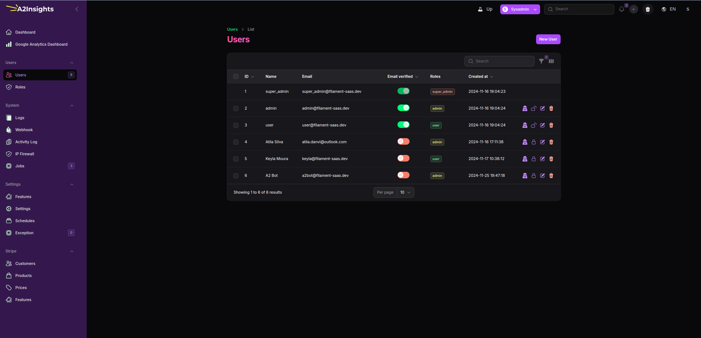
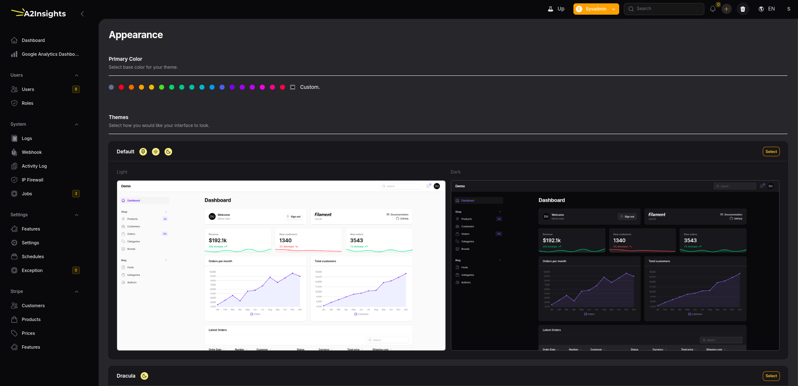
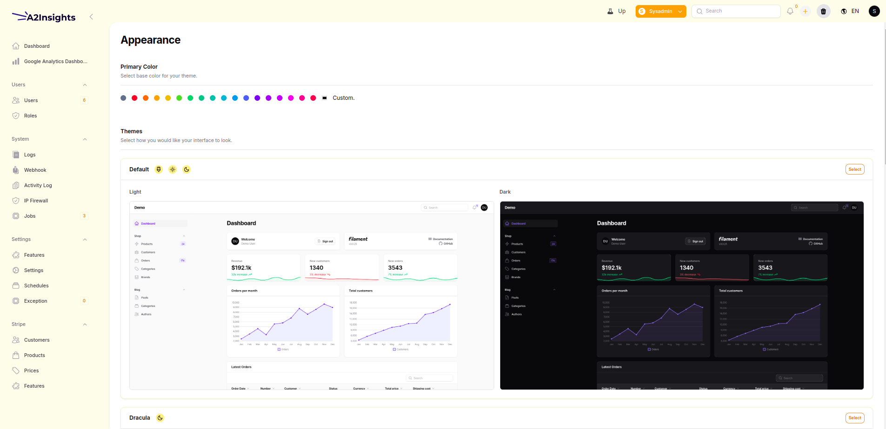
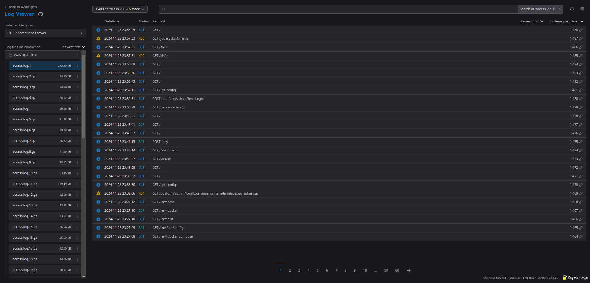
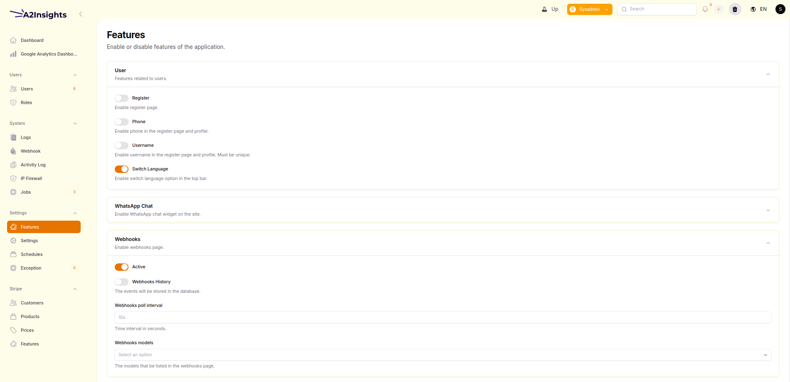
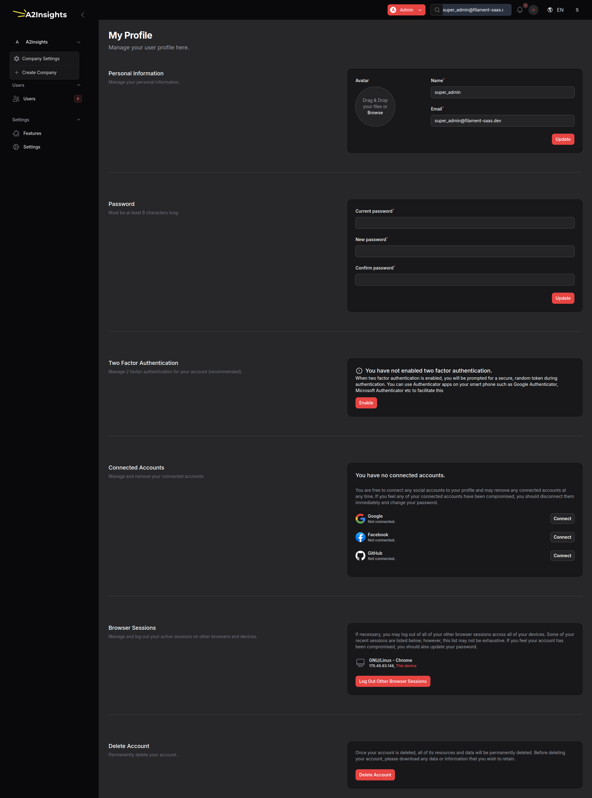
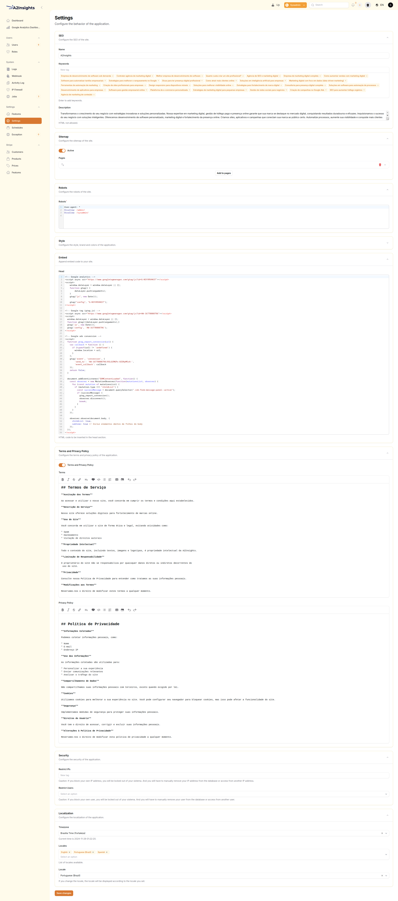

# Filament SaaS

## A stable version is coming.
All changes in the database during the beta versions need to be updated manually. In the first stable versions, I will not introduce several breaking changes without migrations.

## Introduction

The purpose of this project is provide a simple way to create web aplications. We use [Laravel](https://laravel.com/) framework with [Filament Admin](https://filamentphp.com/).

## Dependencies
Below is a list of dependencies used in this package.
A huge thank you to the maintainers of these incredible projects!

| Package                                       | Description                                      | GitHub Repository                                   |
|-----------------------------------------------|--------------------------------------------------|----------------------------------------------------|
| filament/notifications                        | Notifications for Filament                       | [Invalid URL removed]                              |
| filament/spatie-laravel-media-library-plugin  | Spatie Media Library plugin for Filament         | [Invalid URL removed]                              |
| filament/spatie-laravel-settings-plugin       | Spatie Laravel Settings plugin for Filament      | [Invalid URL removed]                              |
| filament/tables                               | Tables for Filament                              | [Invalid URL removed]                              |
| andrewdwallo/filament-companies               | Company management for Filament                 | https://github.com/andrewdwallo/filament-companies |
| awcodes/filament-quick-create                 | Quick create records in Filament                | https://github.com/awcodes/filament-quick-create   |
| bezhansalleh/filament-exceptions              | Custom exception handling for Filament          | https://github.com/bezhansalleh/filament-exceptions|
| bezhansalleh/filament-google-analytics        | Google Analytics integration for Filament       | https://github.com/bezhansalleh/filament-google-analytics |
| bezhansalleh/filament-panel-switch            | Panel switch component for Filament             | [Invalid URL removed]                              |
| bezhansalleh/filament-shield                  | Shield component for Filament                   | https://github.com/bezhansalleh/filament-shield    |
| cms-multi/filament-clear-cache                | Clear cache button for Filament                 | https://github.com/cms-multi/filament-clear-cache  |
| croustibat/filament-jobs-monitor              | Job monitor for Filament                        | https://github.com/croustibat/filament-jobs-monitor|
| hasnayeen/themes                              | Themes for Filament                             | https://github.com/hasnayeen/themes                |
| husam-tariq/filament-database-schedule        | Database schedule for Filament                  | https://github.com/husam-tariq/filament-database-schedule |
| icetalker/filament-picker                     | Picker component for Filament                   | https://github.com/icetalker/filament-picker       |
| jeffgreco13/filament-breezy                   | Breezy integration for Filament                 | https://github.com/jeffgreco13/filament-breezy     |
| joaopaulolndev/filament-pdf-viewer            | PDF viewer for Filament                         | https://github.com/joaopaulolndev/filament-pdf-viewer |
| malzariey/filament-daterangepicker-filter     | Date range picker filter for Filament           | https://github.com/malzariey/filament-daterangepicker-filter |
| marcogermani87/filament-cookie-consent        | Cookie consent for Filament                     | https://github.com/marcogermani87/filament-cookie-consent |
| marjose123/filament-webhook-server            | Webhook server for Filament                     | [Invalid URL removed]                              |
| pxlrbt/filament-environment-indicator         | Environment indicator for Filament              | https://github.com/pxlrbt/filament-environment-indicator |
| pxlrbt/filament-spotlight                     | Spotlight search for Filament                   | https://github.com/pxlrbt/filament-spotlight       |
| solution-forest/filament-field-group          | Field group component for Filament              | [Invalid URL removed]                              |
| solution-forest/filament-firewall             | Firewall for Filament                           | [Invalid URL removed]                              |
| widiu7omo/filament-bandel                     | Bandel integration for Filament                 | https://github.com/widiu7omo/filament-bandel       |
| wiebenieuwenhuis/filament-code-editor         | Code editor for Filament                        | [Invalid URL removed]                              |
| xlite-dev/filament-impersonate                | Impersonation for Filament                      | https://github.com/xlite-dev/filament-impersonate  |
| ysfkaya/filament-phone-input                  | Phone input for Filament                        | https://github.com/ysfkaya/filament-phone-input    |
| z3d0x/filament-logger                         | Logger for Filament                             | https://github.com/z3d0x/filament-logger           |

## Getting started

### Installation

Please check the official laravel installation guide for server requirements before you start. [Official Documentation](https://laravel.com/docs/5.8/installation#installation)

Clone the repository:

    git clone https://github.com/A2Insights/filament-saas-template.git

Switch to the repo folder:

    cd filament-saas-template

Install all php dependencies using composer:

    composer install

Copy the example env file and config the database credentials.

    cp .env.example .env

> See all env vars available in the .env.example file.

Config in the .env the database vars

Generate a new application key:

    php artisan key:generate

Flush de application cache:

    php artisan optimize

Run the database migrations.

    php artisan filament-saas:install

PS: Make sure you set the correct database connection information before running the install command.

Start the local development server:

    php artisan serve

Install all node dependencies using npm:

    npm install

Compile the css and javascript assets:

    npm run dev

You can now access the server at <http://127.0.0.1:8000>

### Finish 

Go to <http://localhost/sysadmin/login> and login with the following credentials:

#### Super Admin
- **Email:** `super_admin@filament-saas.dev`
- **Senha:** `123456`

#### Admin 
- **Email:** `admin@filament-saas.dev`
- **Senha:** `123456`

#### User 
- **Email:** `user@filament-saas.dev`
- **Senha:** `123456`

### Using Laravel Sail to develop

make .env config:

    DB_CONNECTION=mysql
    DB_HOST=mysql
    DB_PORT=3306
    DB_DATABASE=laravel
    DB_USERNAME=root
    DB_PASSWORD=

And run:

    vendor/bin/sail build

    vendor/bin/sail up -d

    vendor/bin/sail sail artisan optimize

    vendor/bin/sail artisan filament-saas:install

    npm run install 

    npm run dev

You can now access the server at <http://localhost>

## The big problem [Livewire+Filament+TenancyForLaravel]

We use Tenancy for Laravel to load the tenant context, but there is a significant issue when using the public or local filesystem driver. https://github.com/archtechx/tenancy/issues/1212. I haven't been able to resolve this and make file uploads work in tenant mode—it only works in non-tenant mode. However, if you're using the S3 driver in production, it works perfectly.

I recommend using a single bucket for all tenants because I tested and verified that it works. There are many tricky issues to pinpoint. I’ve already spent several hours trying to make it work locally in tenant mode but failed. I will wait for further improvements in the package https://tenancyforlaravel.com/ or consider dropping it soon. Since this has not been a problem in production where I use AWS S3 for file storage, I don’t plan to address it for now. However, if you know how to resolve this, feel free to share a solution.

**For more information: <https://laravel.com/docs/sail>**

## Screenshots

### And much more...

## Changelog

Please see [CHANGELOG](CHANGELOG.md) for more information what has changed recently.

## Contributing

Please see [CONTRIBUTING](CONTRIBUTING.md) for details.

## Security

If you discover any security related issues, please email atila.danvi@outlook.com instead of using the issue tracker.

## Credits

-   [Atila Silva](https://github.com/a21ns1g4ts)
-   [All Contributors](../../contributors)

## License

The MIT License. Please see [license file](LICENSE.md) for more information.
